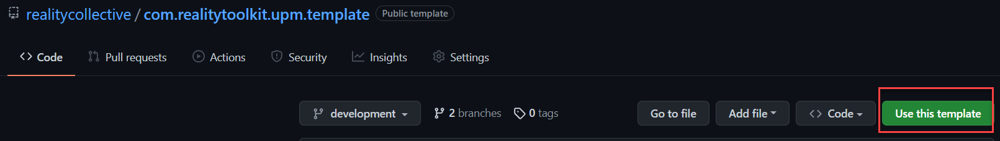
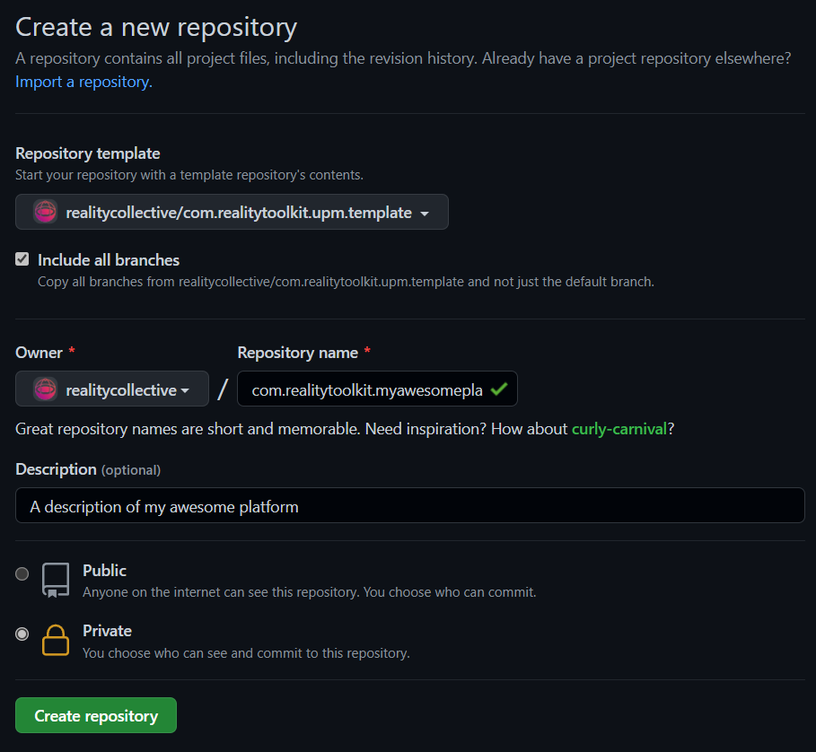
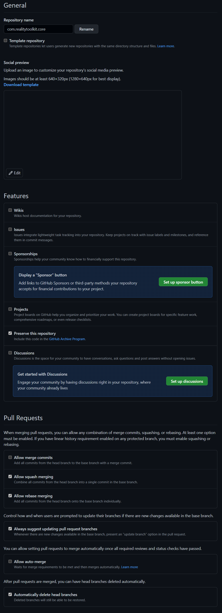
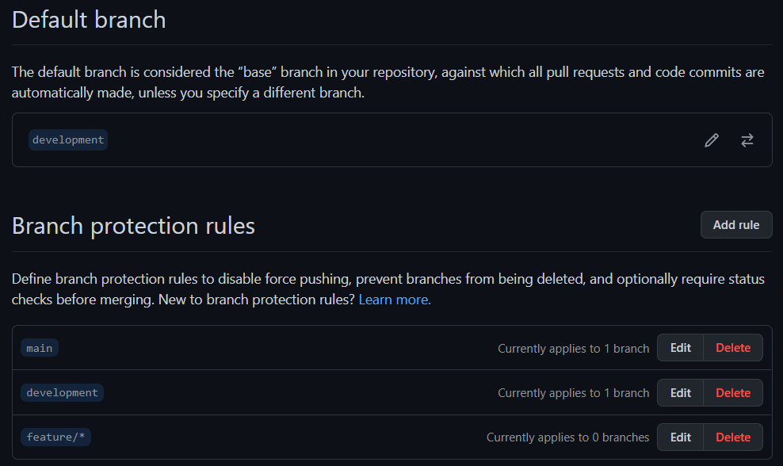
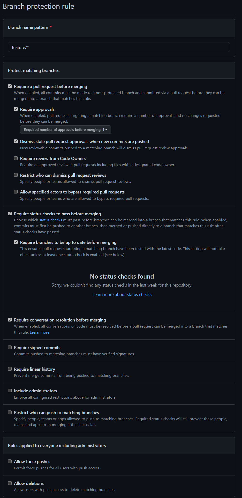

# Reality Collective - Repository Template Generator

To generate a new project for the Reality Toolkit, we have provided a handy repository generator that includes everything you need to get started.

> It is possible to reuse the template generator for your own projects that require UPM dependant packages, however, there is additional setup required for your account to enable the automation to work, if required (if not required, then simply delete the ".github" folder)

Using the Template generator is very easy:


## 1. Create new Project, using either:

* The "Use this template" button from the "*https://github.com/realitycollective/com.realitytoolkit.upm.template*" repository 
    
    <br/>

    

    Or

* Create a new repository and selecting the "*com.realitytoolkit.upm.template*" "Repository template" option
    
    <br/>

    

> Please make sure to select the "**include all branches**" option before clicking "*Create repository*"

<br/>

## 2. Clone project locally as a submodule of "RealityToolkit.dev" in the "Packages" folder.

```
    git submodule add <remote_url> packages\<full project name>
```
> E.G. 
> 
> ```
> git submodule add https://github.com/realitycollective/com.realitytoolkit.myawesomeproject.git packages\com.realitytoolkit.myawesomeproject
>```

## 3. Open powershell window in cloned folder (run powershell if not already in cloned folder)

The "*InitializeTemplate*" script is a powershell script.  Windows 11 includes powershell by default, so simply run "powershell" and navigate to the cloned folder, or open a regular "command prompt" window and navigate to the cloned folder and then run "powershell".

<br/>

## 4. Run the command

```
 ".\InitializeTemplate.ps1 <New Project sub name>"
```

E.G.

```
    ".\InitializeTemplate.ps1 myawesomeproject"
```

Only use the **Name** as everything else is pre-filled in, additional sub names like "myawesomeproject.extension" are allowed.

<br/>

## 5. Delete the "**InitializeTemplate.ps1**" script

Simply remove/delete the file from the repository, it is no longer needed after execution.

<br/>

## 6. Edit "package.json" and ensure values are correct, add any dependencies as needed.

E.G.

```
    "com.realitytoolkit.core": "1.0.0-preview.1"
```

<br/>

## 7. Edit the Build workflow and ensure any dependencies are added to the "Run Unit Tests" job, remove existing Core default if not required.

Inside the "\.github\workflows\buildupmpackages.yml" script, there is a section towards the end named "Run Unit Tests".  It has a section called "dependencies" which is pre-filled in with an entry to the RealityToolkit.core project.

The configuration follows a json strructure, so simply add another {key:value} section in the array.  For an example of multiple dependencies, check the configuration in the [SpatialPersistence.asa build file](https://github.com/realitycollective/com.realitytoolkit.spatial-persistence.asa/blob/464fe2f2ecca423ca02ace1955a9a7004cf7b493/.github/workflows/buildupmpackages.yml#L54)

> Additional instructions on how this works are included in the [source build pipeline file here](https://github.com/realitycollective/reusableworkflows/blob/73475e0c6c40d1ab142fce0fb2d72a6520a4343e/.github/workflows/rununityunittests.yml#L121)

E.G.

```
    dependencies: '[{"rcdevelopment": "github.com/realitycollective/com.realitytoolkit.core.git"}]'
```

**Note*, do not put "https://" at the beginning of the dependency url.

<br/>

## 8. Open Unity and ensure all asset/meta files are generated and no additional errors are present.

The template does not include ANY meta files by default, these need to be generated by Unity, to ensure they are unique.

<br/>

## 9. Check any relevant dependencies for the project are correctly registered in the Package.json dependencies (DO NOT add dependencies to the "RealityToolkit.dev" project.

In the dependencies section of the "package.json", ensure any required components are listed.  Check the ["com.realitytoolkit.core" package.json](https://github.com/realitycollective/com.realitytoolkit.core/blob/rcdevelopment/package.json) for reference

<br/>

## 10. CLOSE Unity.

<br/>

## 11. Push changes to the Source repository for the NEW project.

<br/>

## 12. Check the Build action completes as expected, fix any issues.

Visit the "Actions" tab to see a new "job" run once the update to the repository has been pushed.  This should automatically be recognized by the build pipeline from the template.

If any issues occur, check the logs and resolve these before continuing.

<br/>

## 13. Go to the GitHub Repository and validate Repository Settings:

Go to the "Settings" tab for the repository and in the "General" section, validate the following settings to finalize the repository.

    * Un-check ALL features (these are all run from the RealityToolkit.dev repository)
    * un-check "allow merge commits"
    * Enable "Always suggest updating pull request branches"
    * Enable "Automatically delete head branches"




## 15. Go to the GitHub Repository "**Branches**" section and add branch protections for main, development and feature/*



For each branch, enable the following settings:

    * Require a pull request before merging
    * Require approvals
    * Dismiss stale pull request approvals when new commits are pushed
    * Require status checks to pass before merging
    * Require branches to be up to date before merging
    * Require conversation resolution before merging




## 16. Once the initial check-in actions are complete, remove all pre-failed Actions runs (to tidy up)

This will deliver a UPM style project, complete with the build pipeline and checks necessary for a platform/service to be built upon.