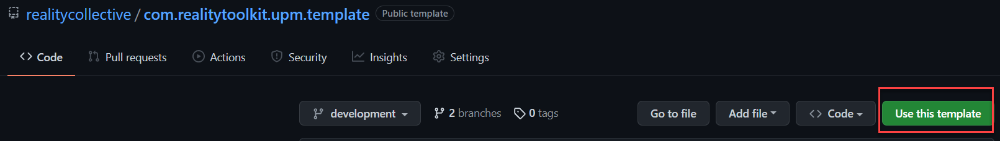
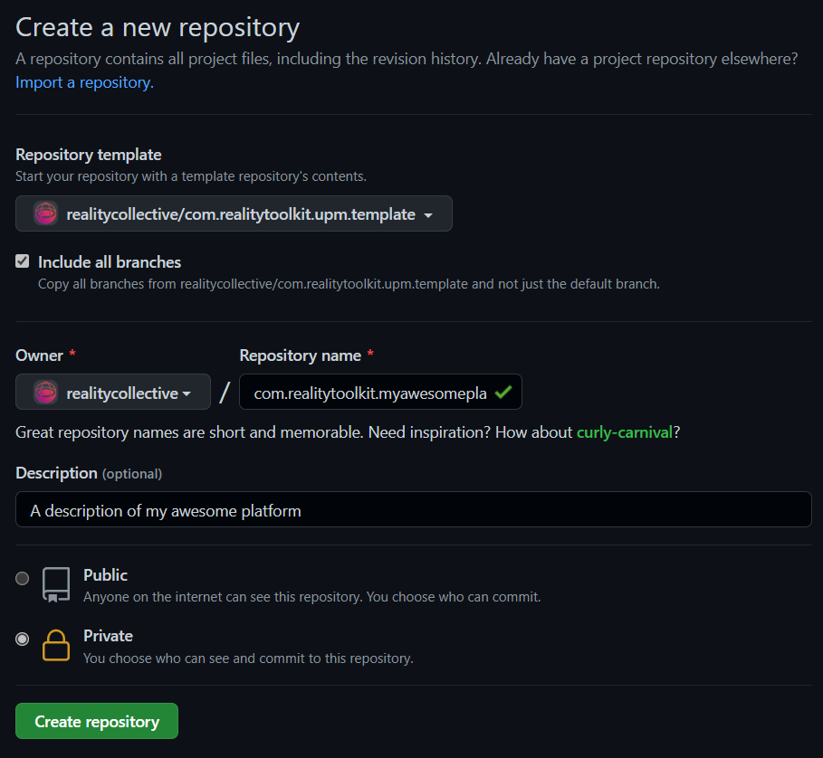
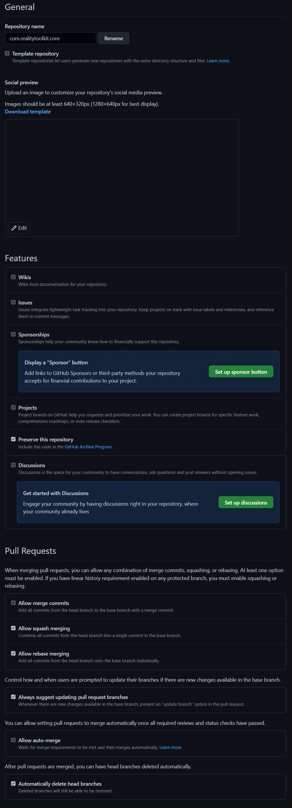
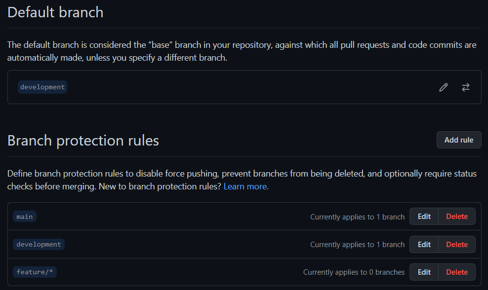
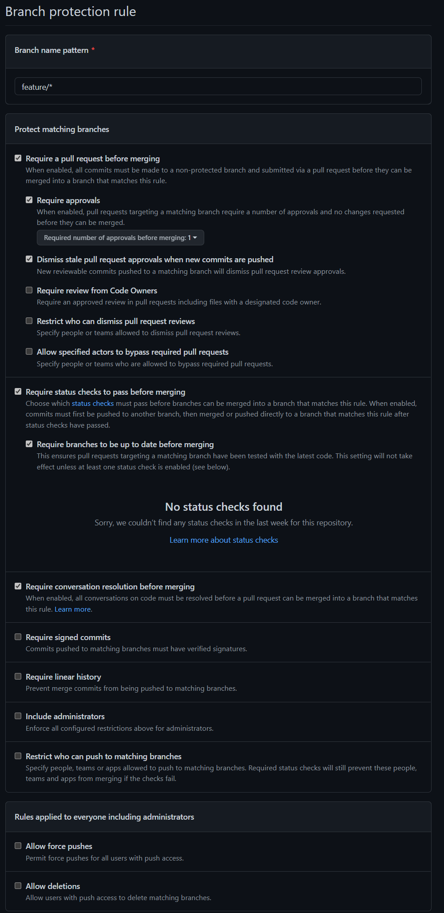

---
mdx:
  format: md
sidebar_position: 3
sidebar_label: 'Repository Template Generator'
title: Repository Template Generator
description: How to create a new Reality Toolkit UPM package from the com.realitytoolkit.upm.template repository
---

# Repository Template Generator


To start a new Unity package for the Reality Toolkit, use the [com.realitytoolkit.upm.template](https://github.com/realitycollective/com.realitytoolkit.upm.template) repository. It is a GitHub template repository: a skeleton UPM (Unity Package Manager) package with runtime, editor and test assemblies, a docs folder, a changelog, a licence, and the three GitHub Actions workflows the Reality Collective uses to build, test and publish every package. Its default branch is `development`.

> The template also works for any project that needs UPM-style dependency handling, not only Reality Toolkit modules. Extra account setup is needed to run the automation on your own repositories; if you do not need it, delete the `.github` folder after creating your repository.

## Before you start

- A GitHub account with access to the `realitycollective` organisation, or your own account if you are creating a personal package.
- The Unity version the template targets: it ships with `"unity": "2021.3"` in `package.json`, so use that version or later.
- PowerShell, to run the initialisation script (Windows 11 includes it; run `powershell` from a command prompt).
- Optionally, an existing Unity project to develop the package in, for example the Collective's `RealityToolkit.dev` project.

## Step 1: Create the repository from the template

On the [template repository](https://github.com/realitycollective/com.realitytoolkit.upm.template) page, click "Use this template", or start a new repository on GitHub and choose `com.realitytoolkit.upm.template` as the "Repository template".





:::tip
Tick "Include all branches" before clicking "Create repository", so `development` and `main` are copied along with the workflow files.
:::

## Step 2: Clone the repository and place it in a Unity project

Clone the new repository locally. To develop and test it, copy or clone it into the `Packages` folder of a Unity project such as `RealityToolkit.dev`, as a plain folder rather than a git submodule for now. Keeping it a plain clone at this stage avoids submodule overhead while you are still resolving meta files and generation issues; once the first build succeeds you convert it to a submodule (Step 10).

## Step 3: Run the initialisation script

Open a PowerShell window in the cloned folder and run `InitializeTemplate.ps1` with the name of your new package, for example:

```
.\InitializeTemplate.ps1 myawesomeproject
```

Pass only the project name; the script fills in everything else, and sub-names such as `myawesomeproject.extension` are allowed. It replaces every `UPMTEMPLATE` placeholder (and its case variants) in the `.json`, `.cs`, `.md` and `.asmdef` files, replaces the placeholder GUID in the C# sources, and renames the files and folders that contain `UPMTEMPLATE`, including the file under `Documentation~`. The script checks for that placeholder file first, so it will refuse to run a second time on an already-initialised repository.

## Step 4: Delete the initialisation script

Remove `InitializeTemplate.ps1` from the repository; it is not needed again.

## Step 5: Edit package.json

Check the values the script did not need to touch, and fill in the rest: `displayName`, `description`, `keywords`, and the `dependencies` block, which ships with `"com.realitytoolkit.core": "1.0.0-pre.37"`. Add any further package dependencies your project needs, and confirm the `unity` minimum version is still correct for what you are building.

## Step 6: Edit the workflow dependencies

Open `.github/workflows/development-buildandtestupmrelease.yml`. Its `Run-Unit-Tests` job passes a `dependencies` input to the reusable build workflow, pre-filled with the Collective's build tools:

```
dependencies: '{"development": "github.com/realitycollective/com.realitycollective.buildtools.git"}'
```

Add an entry for each additional package your project depends on during the build, keyed by the branch name on the dependency's repository and its git URL without the `https://` prefix. See [Reusable workflows](./automation/reusableworkflows.md) for the full dependency JSON format.

## Step 7: Open Unity and resolve meta files

The template ships with no `.meta` files, so Unity must generate them the first time the package is opened, which keeps them unique to your project. Open the host Unity project, let it import the package, and resolve any console errors.

## Step 8: Check the package dependencies

Confirm the packages your code actually uses are listed in `package.json`'s `dependencies` section; check the [com.realitytoolkit.core package.json](https://github.com/realitycollective/com.realitytoolkit.core/blob/rcdevelopment/package.json) for the expected format.

:::warning
Do not add the new package as a dependency in the host Unity project's manifest. Dependencies belong only in the package's own `package.json`.
:::

## Step 9: Close Unity and push

Close the Unity project, then push the changes to the `development` branch of the new repository.

## Step 10: Watch the build, then convert to a submodule

Open the "Actions" tab and confirm the "Build and test UPM packages" workflow runs and passes; fix anything it reports. Once it is green, delete the local plain-cloned copy from the host Unity project's `Packages` folder and re-add the repository as a git submodule instead:

```
git submodule add <remote_url> Packages\<full project name>
```

## Step 11: Set the repository settings

In the repository's "Settings" tab, under "General", uncheck all features (they are managed from the main `RealityToolkit.dev` repository), uncheck "Allow merge commits", enable "Always suggest updating pull request branches", and enable "Automatically delete head branches".



## Step 12: Add branch protection

In "Branches", add protection rules for `main`, `development` and `feature/*`. For each, enable "Require a pull request before merging", "Require approvals", "Dismiss stale pull request approvals when new commits are pushed", "Require status checks to pass before merging", "Require branches to be up to date before merging" and "Require conversation resolution before merging".





## Step 13: Tidy up

Once the first check-in has gone through, delete any failed Actions runs from earlier troubleshooting to keep the "Actions" tab clean.

## What the workflows do

`development-buildandtestupmrelease.yml` runs on every pull request that does not target `main`, plus manual dispatch. It reads the minimum Unity version from `package.json`, checks a self-hosted runner has that version installed, then builds the package and runs its unit tests through the reusable `rununityUPMbuild.yml` workflow, passing the `dependencies` input from Step 6. A pull request cannot merge until this passes; see [Setting up a GitHub build server](./setting_up_github_buildserver.md) for what the runner needs installed.

`development-publish.yml` runs on every push to `development`. It calls the reusable `upversionandtagrelease.yml` workflow with `build-type: pre-release`, so each merge bumps the pre-release version and tags a new release, which OpenUPM then picks up automatically.

`main-publish.yml` runs on every push to `main`. It looks for `no-ver`, `minor-release` or `major-release` in the triggering pull request's title, and defaults to a patch release when none is present, then tags the release, refreshes `development` from `main`, and bumps `development` to the next patch version ready for further work. See [Release pipelines](./automation/releasepipelines.md) for the full versioning rules.

## More information

- [Reusable workflows](./automation/reusableworkflows.md), for the full list of workflows and the dependency JSON format
- [Release pipelines](./automation/releasepipelines.md), for how versioning and publishing work across `development` and `main`
- [Setting up a GitHub build server](./setting_up_github_buildserver.md), for the self-hosted runner the workflows expect
- [com.realitytoolkit.upm.template](https://github.com/realitycollective/com.realitytoolkit.upm.template) on GitHub
- [OpenUPM](https://openupm.com/), where published packages are listed for installation
